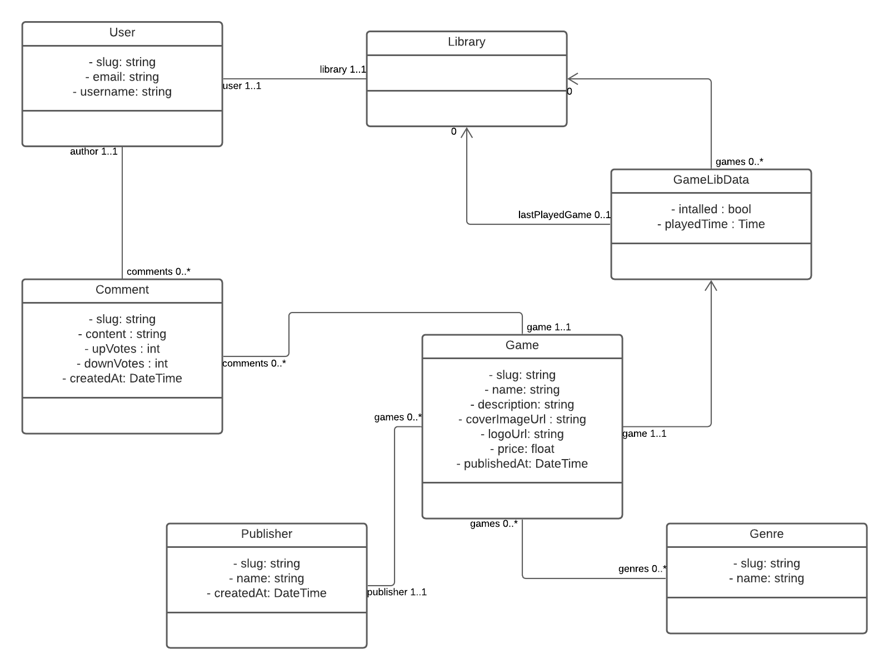

# Introduction

L'objectif sera de réaliser un site internet en Symfony permettant de consulter des bibliothèques de jeux détenu par des utilisateurs.

A la fin de ce projet vous aurez fait un grand tour des fonctionnalités de base de Symfony :

- Entity
- Controller
- Twig/View
- Repository
- Form

## Partie 0

Pour commencer, il faut vous créer un nouveau projet Symfony (Version 5.4) et mettre tout en place comme vue durant le cours !

Si besoin, vous pouvez vous référer au [fichier d'aide pour le lancement d'un projet symfony](./aides/demarrage-symfony.md).

## Partie 1

### Génération des entités

Prenez connaissance du diagramme de classe suivant :



Une fois fait, vous pouvez vous lancer sur la génération des entités de l'application, pour rappel voici des commandes qui pourront vous être utile :

***Pensez à créer votre base de données si vous ne l'avez pas déjà fait ! Voir les étapes 9 et 10 du [fichier de démarrage Symfony](./aides/demarrage-symfony.md)***

```shell
# Création d'une entité :
symfony console make:entity

# Création d'une migration, A FAIRE UNE FOIS TOUTES LES ENTITÉS GÉNÉRÉES :
symfony console make:migration

# Si votre base de données est bien créées vous pouvez lancer la commande suivante pour la mettre à jour :
symfony console doctrine:migrations:migrate
# ou la même mais plus concis
symfony console d:m:m
```

Prenez le temps d'ajouter des données en base (ajoutez en peu pour le moment des fixtures vous seront transmises)

## Partie 2

### Création de la page de listing des utilisateurs

Vous devez créer un controller nommé UserController, petit rappel sur la commande à utiliser pour générer un controller :
```shell
# Création d'une entité :
symfony console make:controller
```

Ce controller ne contiendra pour le moment qu'une seule route `/users` qui sera l'index listant tous nos User.

Dans la méthode qui sera appelé pour cette route vous allez avoir besoin du **UserRepository** pour y appeler la méthode **findAll()** :

```php
$users = $repo->findAll();
```

Dans la vue Twig faite en sorte d'afficher les informations principales (pas besoin d'afficher les jeux présents dans la bibliothèque de l'utilisateur, un lien sera ajouter par la suite pour atteindre cette page)

### Création de la page de listing des jeux

Ici tout comme la section juste avant, mais avec un GameController pour les entités Game.

### Un peu de front-end !

En attendant la correction, prenez le temps de styliser vos pages.

Faites-vous la main sur Twig, n'hésitez pas à vous aider de la [documentation](https://twig.symfony.com/doc/3.x/) ! 


